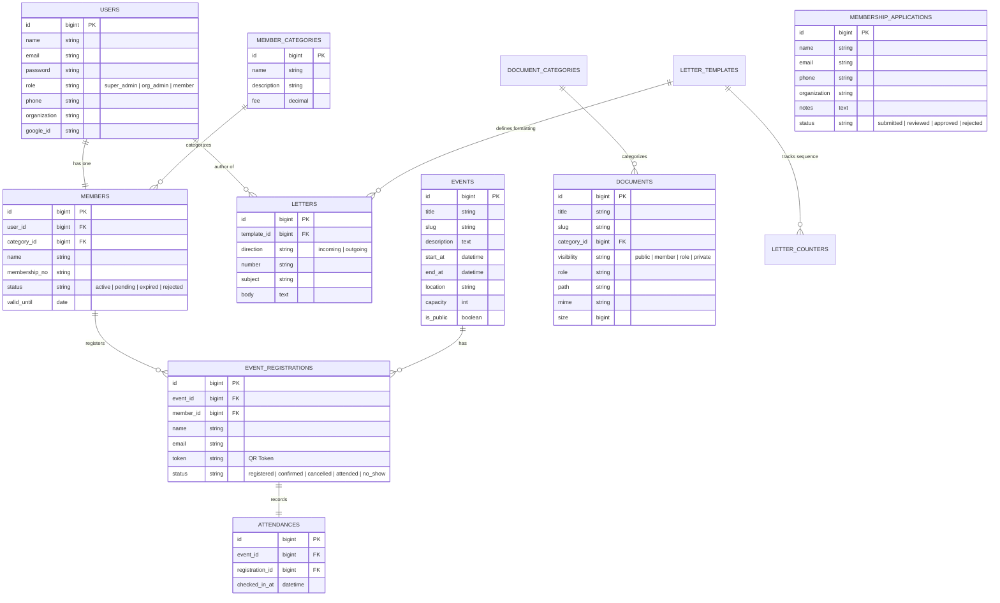

# Dokumen Kebutuhan Produk (Product Requirement Document - PRD)
## Portal Digital Masyarakat Ekonomi Syariah (MES) Kota Depok

Dokumen ini disusun untuk memetakan ide dasar, kebutuhan bisnis, arsitektur teknis, dan kondisi saat ini dari proyek **Website Resmi MES Depok** berdasarkan visualisasi alur pengembangan proyek:
`Idea -> Brainstorming -> Problem + User -> Scope the MVP -> PRD -> TRD -> ERD -> Project Architecture -> Building Plan -> UI Theme -> Build MVP -> Admin/CMS -> Testing -> Launch -> Iterate`.

---

## 1. Idea & Brainstorming (Ide & Brainstorming)
* **Konsep Utama**: Membangun portal digital terintegrasi untuk Masyarakat Ekonomi Syariah (MES) Kota Depok.
* **Tujuan**:
  * Menjadi pusat informasi syiar ekonomi syariah di Kota Depok.
  * Menyediakan sistem keanggotaan (membership) mandiri secara online.
  * Mendigitalisasi operasional internal organisasi seperti surat-menyurat dan arsip dokumen.
  * Menyediakan wadah konsultasi interaktif ekonomi syariah bagi masyarakat.
* **Hasil Brainstorming Fitur**:
  * Landing page dinamis yang bisa diubah oleh pengurus.
  * Portal berita/artikel & agenda kegiatan (event) terintegrasi.
  * Pendaftaran anggota online dengan dashboard profil pribadi dan KTA digital.
  * Manajemen persuratan (surat masuk/keluar, penomoran otomatis dengan template).
  * Repositori dokumen dengan hak akses bertingkat (Publik vs Anggota vs Peran Tertentu).
  * Sistem notifikasi inbox dan broadcast dari admin ke anggota.

---

## 2. Problem & User (Masalah & Pengguna)
### Masalah yang Diselesaikan:
1. **Administrasi Manual**: Pendaftaran anggota dan persuratan organisasi sebelumnya dilakukan secara manual atau menggunakan platform pihak ketiga yang terpisah.
2. **Keterbatasan Informasi**: Program kerja dan event MES Depok sulit diakses secara terpusat oleh masyarakat.
3. **Keamanan Arsip**: Dokumen penting organisasi sering kali tidak terarsip dengan baik berdasarkan tingkat kerahasiaannya.
4. **Jalur Komunikasi Satu Arah**: Sulitnya melakukan broadcast pengumuman penting secara langsung ke seluruh anggota terdaftar.

### Profil Pengguna (User Personas):
* **Pengunjung Publik (Guest)**: Masyarakat umum yang ingin membaca artikel, mendaftar event, mendownload berkas publik, berkonsultasi, atau mendaftar menjadi anggota.
* **Anggota Terdaftar (Member)**: Anggota MES Depok yang memiliki akses ke dashboard portal anggota, KTA digital, dan dokumen khusus anggota.
* **Admin Organisasi (Org Admin)**: Pengurus MES Depok yang mengelola konten berita, agenda event, memproses konsultasi, mengunggah berkas dokumen, serta mengarsipkan surat masuk/keluar.
* **Super Admin**: Administrator sistem tertinggi yang memiliki hak penuh terhadap seluruh data, pengelolaan akun admin, pengiriman broadcast notifikasi, dan perubahan tampilan beranda (landing page).

---

## 3. Scope of MVP (Ruang Lingkup MVP)
Untuk rilis pertama (Minimum Viable Product), ruang lingkup dibatasi pada fitur-fitur inti:
* [x] **Autentikasi**: Login, Registrasi Anggota, dan Google OAuth.
* [x] **Landing Page & Profil**: Beranda interaktif dengan kustomisasi dinamis (Hero Title, Subtitle, CTA Link, Partner Logos).
* [x] **Membership Application**: Formulir registrasi bagi calon anggota untuk divalidasi oleh admin.
* [x] **Portal Anggota**: Dashboard untuk mengunduh Kartu Tanda Anggota (KTA) digital dan edit profil (nama, email, password, instansi).
* [x] **CMS Content**: CRUD berita/artikel, program kerja, dan agenda kegiatan (event).
* [x] **Event Registration**: Pendaftaran event secara online bagi publik dengan penandaan status kehadiran.
* [x] **Document Repository**: Pengunggahan dokumen berdasarkan kategori dan tingkat visibilitas (Public, Member, Role-based).
* [x] **Letter Management**: Pencatatan surat masuk & keluar dengan generator nomor surat otomatis berbasis template.
* [x] **Consultation System**: Pengajuan pertanyaan konsultasi ekonomi syariah oleh publik untuk diproses admin.
* [x] **Notification Center**: Inbox notifikasi di dashboard anggota dan fitur broadcast pengumuman dari admin.

---

## 4. Product Requirements (Kebutuhan Fitur Detail)

### 4.1. Halaman Publik (Public Portal)
| ID Fitur | Nama Fitur | Deskripsi | Prioritas | Status |
| :--- | :--- | :--- | :--- | :--- |
| FR-PUB-01 | Landing Page Dinamis | Menampilkan metrik organisasi, event mendatang, berita terbaru, dan logo mitra. Kustomisasi melalui Admin Panel. | High | Terimplementasi |
| FR-PUB-02 | Detail Program Kerja | Menampilkan daftar program kerja aktif lengkap dengan deskripsi dan konten detail. | Medium | Terimplementasi |
| FR-PUB-03 | Berita & Artikel | Menampilkan rilis berita dan artikel dakwah syariah dengan fitur pencarian dan paginasi. | High | Terimplementasi |
| FR-PUB-04 | Agenda & Registrasi Event | Pengunjung dapat melihat agenda kegiatan terdekat dan melakukan pendaftaran langsung secara online. | High | Terimplementasi |
| FR-PUB-05 | Pendaftaran Keanggotaan | Formulir pengajuan keanggotaan online (nama, email, nomor HP, instansi/organisasi, catatan tambahan). | High | Terimplementasi |
| FR-PUB-06 | Pengajuan Konsultasi | Formulir publik untuk mengajukan konsultasi ekonomi syariah ke pengurus MES. | Medium | Terimplementasi |
| FR-PUB-07 | Unduh Dokumen Publik | Akses download dokumen/regulasi/edukasi yang diset dengan visibilitas "Public". | Medium | Terimplementasi |

### 4.2. Portal Anggota (Member Dashboard)
| ID Fitur | Nama Fitur | Deskripsi | Prioritas | Status |
| :--- | :--- | :--- | :--- | :--- |
| FR-MEM-01 | Dashboard Utama | Menampilkan ringkasan status keanggotaan dan pintasan kartu digital. | High | Terimplementasi |
| FR-MEM-02 | Kartu Anggota Digital (KTA) | Halaman khusus menampilkan KTA digital berisikan Nama Anggota, Nomor Keanggotaan, dan masa berlaku. | High | Terimplementasi |
| FR-MEM-03 | Edit Profil | Mengubah informasi profil pribadi, instansi/organisasi, nomor telepon, serta ganti password. | High | Terimplementasi |
| FR-MEM-04 | Pusat Notifikasi | Menerima pesan/notifikasi langsung dari admin pengurus organisasi. | Medium | Terimplementasi |

### 4.3. Panel Admin (Admin Dashboard)
| ID Fitur | Nama Fitur | Deskripsi | Prioritas | Status |
| :--- | :--- | :--- | :--- | :--- |
| FR-ADM-01 | Statistik & Charts | Ringkasan grafik pertumbuhan anggota (6 bulan terakhir) dan partisipasi event (Livewire + API). | High | Terimplementasi |
| FR-ADM-02 | Verifikasi Anggota | Melakukan review terhadap pengajuan keanggotaan (Approve -> generate nomor KTA otomatis / Reject). | High | Terimplementasi |
| FR-ADM-03 | Manajemen Surat (Letters) | CRUD surat masuk/keluar, otomatisasi penomoran menggunakan template format penomoran fleksibel. | High | Terimplementasi |
| FR-ADM-04 | Manajemen Dokumen | Mengunggah dokumen, menentukan visibilitas akses berdasarkan kategori dan level akses user. | Medium | Terimplementasi |
| FR-ADM-05 | Broadcast Notifikasi | Menu admin untuk mengirimkan notifikasi database/email secara massal ke anggota. | High | Terimplementasi |
| FR-ADM-06 | Landing Page Customizer | Mengubah Hero Section (judul, deskripsi, gambar, link tombol) secara visual tanpa menyentuh kode. | Medium | Terimplementasi |
| FR-ADM-07 | Ekspor Data ke CSV | Melakukan ekspor data Anggota, Kegiatan, Dokumen, dan Konsultasi ke format `.csv`. | High | Terimplementasi |

---

## 5. Technical Requirements (TRD) & Project Architecture
* **Bahasa & Framework**: PHP >= 8.2 dengan Laravel 11.
* **Frontend Component**: Livewire (untuk interaksi reaktif tanpa reload pada admin & event), Blade Templates, Tailwind CSS (styling UI).
* **Database**: MySQL 8.x.
* **Optimasi Kecepatan**: Penggunaan `Illuminate\Support\Facades\Cache` pada query landing page (metrik, agenda, berita, partner) dan grafik dashboard (600 detik cache lifetime).
* **Struktur Direktori Utama**:
  ```text
  app/
  ├── Http/Controllers/
  │   ├── Admin/                  # Controller CRUD Admin (Program, Artikel, dsb)
  │   ├── PublicSite/             # Controller Halaman Publik (Berita, Event, dsb)
  │   └── AuthController.php      # Autentikasi sistem & Google OAuth
  ├── Livewire/                   # Komponen Reaktif (Dashboard, Notifikasi, dsb)
  └── Models/                     # Defini Eloquent Models (User, Member, Event, dsb)
  resources/
  └── views/
      ├── admin/                  # Tampilan Dashboard & CRUD Admin
      ├── layouts/                # Base layouts (app.blade.php & public.blade.php)
      ├── livewire/               # Blade views komponen Livewire
      ├── member/                 # Tampilan Portal Anggota (Profile & Card)
      └── public/                 # Tampilan Landing Page & Halaman Informasi Publik
  ```

---

## 6. ERD & Database Schema (Skema Basis Data)
Berikut skema tabel utama beserta kolom penting yang sudah diimplementasikan di migrasi database:



---

## 7. UI Direction & Theme (Gaya Visual & Desain)
* **Pendekatan Desain**: Clean, modern, corporate-religious dengan tone warna hijau/teal syariah yang ramah di mata dan memberikan impresi profesional terpercaya.
* **Palette Warna**:
  * Warna Utama: Dinamis berbasis pengaturan admin (`theme.primary_color`), terintegrasi di komponen header dan tombol.
  * Latar Belakang: Dominasi putih/abu-abu terang pada area publik, dan dark-mode sidebar/clean cards pada area admin.
* **Tipografi**: Menggunakan font sans-serif modern (Inter / Outfit / Roboto) untuk meningkatkan keterbacaan data tabel dan dokumen.
* **Aksesibilitas**: Responsif pada layar desktop maupun mobile (terutama menu filter anggota dan form persuratan).

---

## 8. Testing & Validation (Pengujian)
1. **Automated Testing**:
   * Pengujian unit & fitur via PHPUnit untuk verifikasi hak akses middleware (`auth` dan `role:super_admin,org_admin,member`).
2. **Manual Testing**:
   * Validasi ekspor CSV data persuratan dan keanggotaan untuk memastikan kompatibilitas format.
   * Uji laju pembatasan akses (throttling) pada halaman formulir sensitif (seperti `/contact` dan `/membership` submit).

---

## 9. Tahap Saat Ini & Rencana Iterasi (Status Saat Ini)

### Sudah Sampai Mana?
Berdasarkan alur pengembangan proyek, status proyek saat ini berada pada tahap **Build the MVP / Admin CMS**:
* Seluruh model database (ERD), fungsionalitas backend, otorisasi peran (Role), integrasi Google OAuth, generator surat otomatis, dan interface dashboard reaktif dengan Livewire **telah selesai dibangun dan berfungsi**.
* Kode siap untuk masuk ke tahap **Testing & Validation** (baik automated maupun manual oleh pengurus) sebelum akhirnya dilakukan **Launch (Peluncuran)** versi produksi.

### Rencana Iterasi Selanjutnya (Iterate):
1. **Automated Payment Gateway**: Mengintegrasikan Midtrans/Duitku untuk pembayaran biaya keanggotaan (`fee` di `member_categories`) secara otomatis saat pendaftaran disetujui.
2. **QR Code Attendance System**: Menggunakan `token` di tabel `event_registrations` untuk memindai kehadiran peserta event secara langsung di lokasi acara menggunakan kamera smartphone (mobile-friendly scan interface).
3. **E-Signature Integrasi**: Penandatanganan surat keluar secara digital (e-signature) pada modul `letters` menggunakan sertifikat PDF tepercaya.
